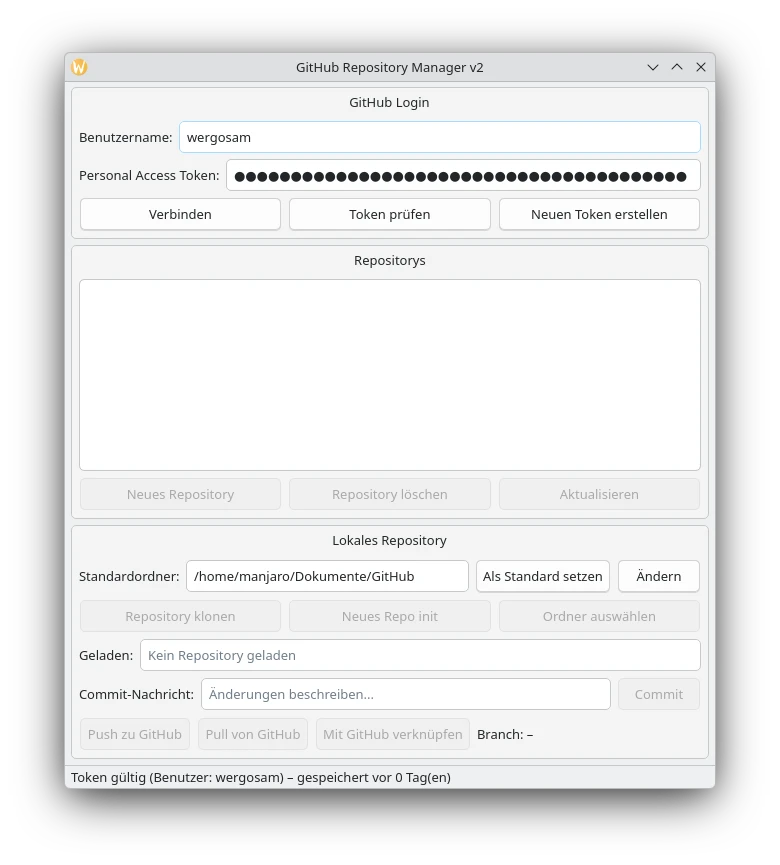

# GitHub Repository Manager

🇩🇪 [Deutsch](#deutsch) | 🇬🇧 [English](#english)

---

<a id="deutsch"></a>
## 🇩🇪 Deutsch

Ein PyQt6-Desktop-Tool für Linux, mit dem sich GitHub-Repositories und lokale Git-Repositories verwalten lassen – ganz ohne Terminal. Login per Personal Access Token, Repositories erstellen/löschen/klonen, lokale Ordner verknüpfen, committen, pushen und pullen. Die Oberfläche ist mehrsprachig (Deutsch/Englisch, beliebig erweiterbar).



### Features

- **GitHub-Login** per Personal Access Token (PAT), inkl. Token-Prüfung und Komfort-Link zum Erstellen eines neuen Tokens
- **Repository-Verwaltung**: GitHub-Repositories auflisten, neu erstellen, löschen und die Liste aktualisieren
- **Lokale Repositories**:
  - Bestehendes GitHub-Repository klonen
  - Neues lokales Repository erstellen (`git init`) und automatisch mit einem GitHub-Repository verknüpfen
  - Beliebigen vorhandenen Ordner als Git-Repository laden
  - Nachträgliches Verknüpfen eines Ordners ohne Remote über **„Mit GitHub verknüpfen“**
- **Commit / Push / Pull** direkt aus der GUI
  - Erkennt leere Commits (keine Änderungen gefunden) und abgelehnte Pushes, statt fälschlich „Erfolg“ zu melden
  - Fragt bei abweichendem Branch-Namen (z. B. lokal `master`, GitHub-Standard `main`) aktiv nach, wohin gepusht werden soll
- **Standardordner** für alle lokalen Repositories konfigurierbar
- **Mehrsprachige Oberfläche** (Deutsch/Englisch):
  - Automatische Erkennung der Systemsprache beim ersten Start
  - Manuelle Umschaltung jederzeit über das Menü **„Sprache“** – die Oberfläche wird sofort live aktualisiert, kein Neustart nötig
  - Die gewählte Sprache wird gespeichert und beim nächsten Start automatisch geladen
  - Übersetzungen liegen zentral in `translations.py` und lassen sich einfach um weitere Sprachen erweitern
- Integriertes **Benutzerhandbuch** (Hilfe-Menü / F1) und **Über-Dialog** mit Versions- und Autoreninfo
- Automatische Erkennung der Linux-Distribution (Arch, Debian/Ubuntu, Fedora/RHEL/CentOS, openSUSE) und automatische Installation fehlender Abhängigkeiten

### Voraussetzungen

- Python 3.10+
- Linux (getestet unter Arch / Manjaro)
- Ein GitHub Personal Access Token mit dem Scope `repo`

#### Abhängigkeiten

- [PyQt6](https://pypi.org/project/PyQt6/)
- [PyGithub](https://pypi.org/project/PyGithub/)
- [GitPython](https://pypi.org/project/GitPython/)

Fehlende Pakete werden beim ersten Start automatisch erkannt; das Skript bietet an, sie über den Systempaketmanager oder per `pip --user` zu installieren.

### Installation

```bash
git clone https://github.com/<dein-benutzername>/<repo-name>.git
cd <repo-name>
python3 github_manager.py
```

Alternativ manuell installieren:

```bash
pip install --user PyQt6 PyGithub GitPython
```

> **Hinweis:** `translations.py` muss im selben Ordner wie `github_manager.py` liegen, da das Hauptskript die Übersetzungen von dort importiert.

### Verwendung

1. **Verbinden**: Benutzername und Personal Access Token eingeben, auf „Verbinden“ klicken.
2. **Repository wählen**: In der Liste ein GitHub-Repository auswählen.
3. **Lokal einrichten**:
   - *Repository klonen* – lädt das ausgewählte Repository in den Standardordner
   - *Neues Repo init* – erstellt einen neuen lokalen Ordner und verknüpft ihn mit dem ausgewählten Repository
   - *Ordner auswählen* – lädt einen bereits vorhandenen lokalen Ordner (bei fehlendem Remote über „Mit GitHub verknüpfen“ nachträglich verbinden)
4. **Änderungen übertragen**: Commit-Nachricht eingeben → „Commit“ → „Push zu GitHub“.
5. **Änderungen holen**: „Pull von GitHub“.
6. **Sprache wechseln**: Im Menü „Sprache“ die gewünschte Sprache auswählen – die Auswahl wird dauerhaft gespeichert.

### Konfigurationsdateien

Zugangsdaten und Einstellungen werden lokal unter `~/.config/github_manager/` gespeichert:

| Datei | Inhalt |
|---|---|
| `config.json` | Benutzername und Token (Dateirechte `600`) |
| `settings.json` | Standardordner für lokale Repositories und gewählte Sprache |

### Sicherheitshinweis

Der Personal Access Token wird lokal im Klartext in `config.json` gespeichert (mit restriktiven Dateirechten). Verwende nach Möglichkeit einen Fine-grained Token mit minimalen Berechtigungen und beschränkter Repository-Auswahl.

### Lizenz

Dieses Projekt ist unter der **GNU General Public License v3.0** lizenziert. Sie
dürfen dieses Programm frei verwenden, verändern und weitergeben, solange
abgeleitete Werke ebenfalls unter der GPL v3 veröffentlicht werden. Siehe die
Datei [LICENSE](LICENSE) für den vollständigen Lizenztext oder besuchen Sie
<https://www.gnu.org/licenses/gpl-3.0.html>.

---

<a id="english"></a>
## 🇬🇧 English

A PyQt6 desktop tool for Linux that lets you manage GitHub repositories and local Git repositories – entirely without a terminal. Login via Personal Access Token, create/delete/clone repositories, link local folders, commit, push, and pull. The interface is multilingual (German/English, easily extendable).


### Features

- **GitHub login** via Personal Access Token (PAT), including token validation and a convenient link to create a new token
- **Repository management**: list, create, and delete GitHub repositories, and refresh the list
- **Local repositories**:
  - Clone an existing GitHub repository
  - Initialize a new local repository (`git init`) and automatically link it to a GitHub repository
  - Load any existing folder as a Git repository
  - Retroactively link a folder without a remote via **"Link to GitHub"**
- **Commit / Push / Pull** directly from the GUI
  - Detects empty commits (no changes found) and rejected pushes instead of falsely reporting "success"
  - Actively asks where to push when the branch name differs (e.g. local `master` vs. GitHub default `main`)
- **Default folder** configurable for all local repositories
- **Multilingual interface** (German/English):
  - Automatically detects the system language on first launch
  - Manual switching at any time via the **"Language"** menu – the interface updates live instantly, no restart required
  - The chosen language is saved and loaded automatically the next time the app starts
  - Translations are centralized in `translations.py` and can easily be extended with additional languages
- Built-in **user guide** (Help menu / F1) and **About dialog** with version and author info
- Automatic detection of the Linux distribution (Arch, Debian/Ubuntu, Fedora/RHEL/CentOS, openSUSE) and automatic installation of missing dependencies

### Requirements

- Python 3.10+
- Linux (tested on Arch / Manjaro)
- A GitHub Personal Access Token with the `repo` scope

#### Dependencies

- [PyQt6](https://pypi.org/project/PyQt6/)
- [PyGithub](https://pypi.org/project/PyGithub/)
- [GitPython](https://pypi.org/project/GitPython/)

Missing packages are automatically detected on first launch; the script offers to install them via the system package manager or via `pip --user`.

### Installation

```bash
git clone https://github.com/<your-username>/<repo-name>.git
cd <repo-name>
python3 github_manager.py
```

Alternatively, install manually:

```bash
pip install --user PyQt6 PyGithub GitPython
```

> **Note:** `translations.py` must be located in the same folder as `github_manager.py`, since the main script imports the translations from there.

### Usage

1. **Connect**: enter your username and Personal Access Token, then click "Connect".
2. **Select a repository**: choose a GitHub repository from the list.
3. **Set up locally**:
   - *Clone repository* – downloads the selected repository into the default folder
   - *Init new repo* – creates a new local folder and links it to the selected repository
   - *Select folder* – loads an already existing local folder (link it retroactively via "Link to GitHub" if no remote is configured)
4. **Push changes**: enter a commit message → "Commit" → "Push to GitHub".
5. **Fetch changes**: "Pull from GitHub".
6. **Switch language**: choose your preferred language from the "Language" menu – the selection is saved permanently.

### Configuration files

Credentials and settings are stored locally under `~/.config/github_manager/`:

| File | Content |
|---|---|
| `config.json` | Username and token (file permissions `600`) |
| `settings.json` | Default folder for local repositories and selected language |

### Security note

The Personal Access Token is stored locally in plain text in `config.json` (with restrictive file permissions). Whenever possible, use a fine-grained token with minimal permissions and a limited repository selection.

### License

This project is licensed under the **GNU General Public License v3.0**. You
are free to use, modify, and redistribute this program, provided that
derivative works are also released under the GPL v3. See the
[LICENSE](LICENSE) file for the full license text, or visit
<https://www.gnu.org/licenses/gpl-3.0.html>.
